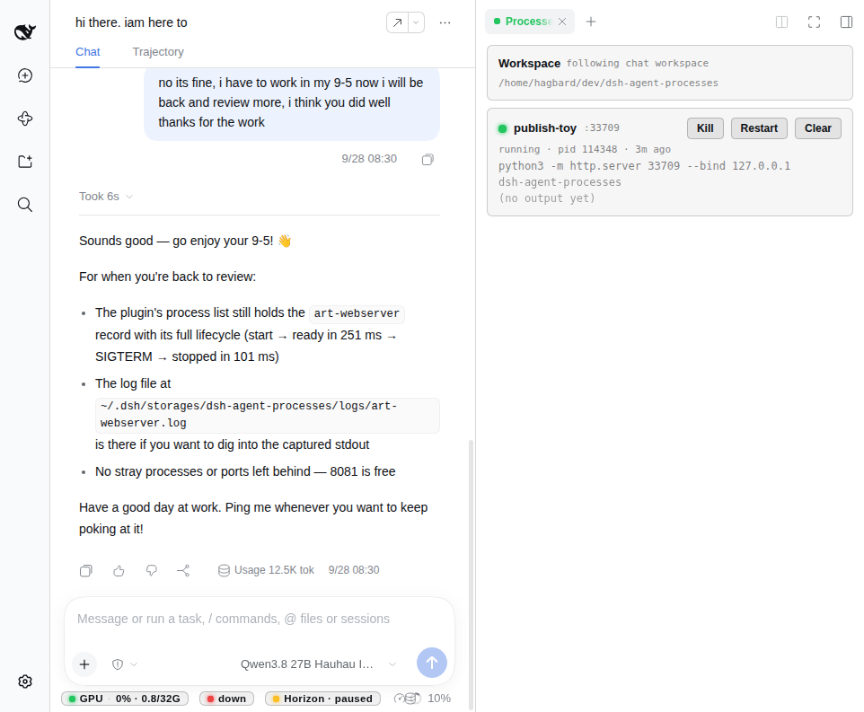
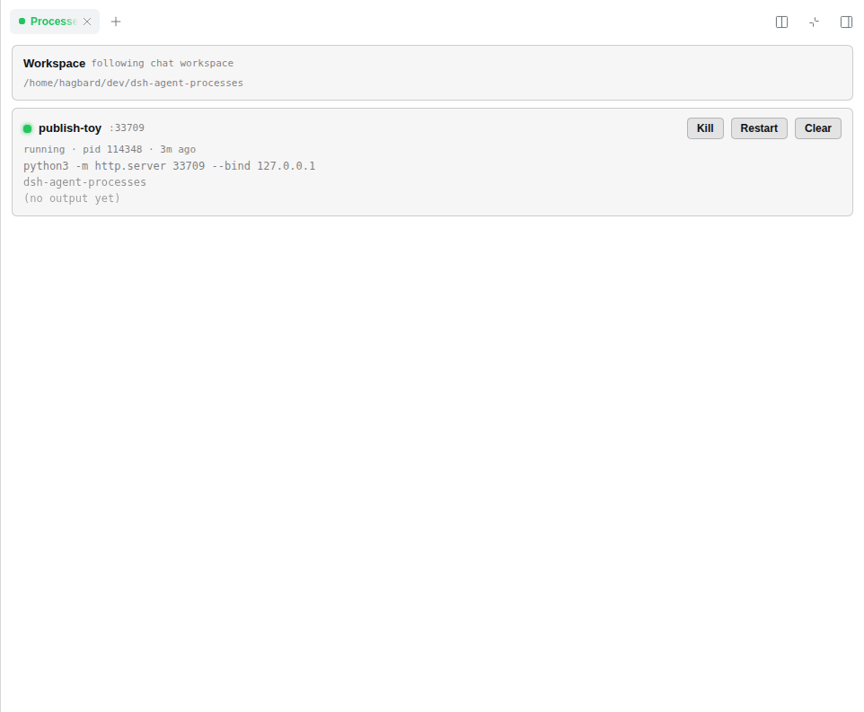
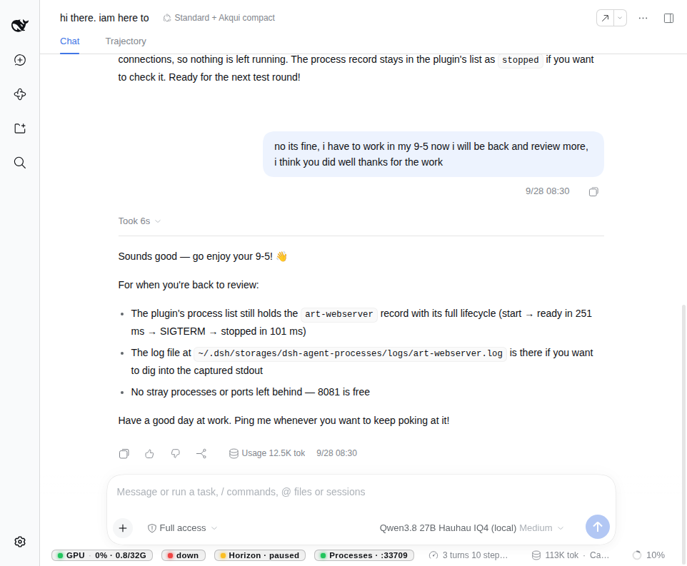

# dsh-agent-processes

Host-owned **process & port lifecycle** for local coding agents in the
**DeepSeek Harness** web UI.

Long-lived local processes started through raw `bash` become zombies: the agent
forgets the PID, the port stays held, the next start hits `EADDRINUSE`, and the
agent rewrites code around a bug that was really a port. This plugin gives the
agent first-class hands — **start / stop / list / logs / wait-ready** with a
persistent vault — plus a **Processes** rightbar and composer dock chip for the
human.

**Related plugins** (same dual-face `dsh.bundle` shape for the web rightbar / dock):

| Plugin | Repo |
| --- | --- |
| Long-horizon task status | [`dsh-local-long-horizon`](https://github.com/janpauldahlke/dsh-local-long-horizon) |
| NVIDIA GPU util / VRAM / power | [`dsh-gpu-monitor-nvml`](https://github.com/janpauldahlke/dsh-gpu-monitor-nvml) |
| Local LLM endpoint / slot health | [`dsh-slot-health`](https://github.com/janpauldahlke/dsh-slot-health) |

This package: [`dsh-agent-processes`](https://github.com/janpauldahlke/dsh-agent-processes).

Verified against DeepSeek Harness **`0.1.7-rc.2`** (`dsh web`).

---

## Requirements

- DeepSeek Harness web profile (`dsh web`).
- Node.js **≥ 20** to build.

---

## Screenshots

Light theme, matching the DSH default.

| Pane + chat (mid-run) | Processes pane (fullscreen) |
| --- | --- |
|  |  |

| Dock chip (rightbar closed, chat metrics active) |
| --- |
|  |

---

## What you see

- **Processes rightbar** — follows the open chat workspace. Per-record card:
  status dot (green running / amber starting / red crashed / grey stopped),
  id + port, pid + age, command, cwd basename, log preview, and
  **Kill** / **Restart** / **Clear**.
- **Dock chip** — on the chat metrics strip when the rightbar is closed and
  something is running for the followed workspace (`Processes · :3000`,
  `Processes · 3 running`, …). Click opens the pane.
- **Tracked reclaim** — starting with a `port` stops any tracked holder of that
  port first; **foreign (untracked) holders are refused, never killed**.

---

## Install

```sh
git clone https://github.com/janpauldahlke/dsh-agent-processes.git
cd dsh-agent-processes
npm install && npm run build
dsh plugin --profile web add "$(pwd)"
```

Restart (or boot) `dsh web` so the host + client faces load:

```sh
env -u DSH_WEB_URL -u DSH_SHELL -u DSH_SESSION_ID dsh web --no-open
```

Uninstall:

```sh
dsh plugin --profile web remove dsh-agent-processes
# restart the web instance that had the plugin
```

No harness `file:` dependencies — the host registers tools on the live
`ctx.tools` service provided by dsh. Rebuild `lib/` after edits; client changes
hot-load, host changes need a web-shell restart.

---

## Agent tools

| Tool | Purpose |
| --- | --- |
| `process_start` | Spawn + track; optional port wait / reclaim |
| `process_stop` | SIGTERM → 3s grace → SIGKILL (process group) |
| `process_list` | All tracked records (liveness re-checked) |
| `process_logs` | Tail a record's captured log |
| `process_wait_ready` | Poll until `127.0.0.1:port` accepts (or timeout) |
| `process_ping` | Plugin liveness probe |

**`process_start` with `port`:**

1. **Reclaim** — stop every tracked, live holder of that port; report ids in `reclaimed[]`.
2. **Foreign check** — if the port still accepts connections, refuse with a typed error (no kill).
3. **Readiness** — TCP connect to `127.0.0.1:P` (default timeout 15s). Timeout is a
   success-shaped result with `error: 'port-timeout'`; the process is left running.

Records store lossless `argv` so UI / route **restart** re-runs the same command
under the same id.

---

## Surfaces

| Surface | Path / name |
| --- | --- |
| Vault | `~/.dsh/storages/dsh-agent-processes/processes.json` |
| Logs | `~/.dsh/storages/dsh-agent-processes/logs/<id>.log` |
| HTTP | `GET` / `POST` `/api/dsh-agent-processes` |
| UI | Rightbar **Processes** + composer dock chip |

```
GET  /api/dsh-agent-processes
→ { ok, package, version, storageRoot, count, processes: […] }

POST /api/dsh-agent-processes  { "action": "stop" | "restart" | "remove", "id": "…" }
```

The pane polls every 2s (refcounted — stops when the last viewer unmounts).

---

## Recommended `AGENTS.md` snippet

```markdown
## Long-lived processes — use dsh-agent-processes

For anything that stays up (dev servers, watchers, long `node` servers):

- Start with `process_start` (include `port` if it listens). It reclaims tracked
  holders of that port, refuses foreign ones, and waits for TCP readiness —
  do **not** start long-lived processes with raw `bash` or backgrounded `&`.
- Before assuming a port is free, check `process_list`; after starting, use
  `process_wait_ready` instead of `sleep`.
- Stop with `process_stop`. Read `process_logs` when something looks wrong.
- On crash or port failure: read `process_logs`, fix, `process_start` again,
  verify with `process_wait_ready`.
- Never kill untracked PIDs; if a foreign process holds the port, free it
  manually or start on another port.
```

---

## Architecture

Dual-face package (same bar as the other web rightbar / dock plugins):

- **Host** (`lib/index.js`, ESM) — vault, tools, HTTP route.
- **Client** (`lib/client.js`, CJS ModuleLoader factory) — rightbar + dock chip.
- **Glue** — `cordis.patch.yml` + `dsh.bundle` / `dsh.client` in `package.json`.

```
dsh-agent-processes/
├── package.json
├── build.mjs
├── cordis.patch.yml
├── media/                 # README screenshots
├── scripts/               # shippable lifecycle smoke
├── test/                  # node --test (vault + service)
├── src/host/              # vault, service, tools, route
├── src/client/            # pane + dock chip
├── src/shared/            # shared types
└── lib/                   # built artifacts (required at runtime)
```

---

## Develop / test

```sh
npm test          # node --test (vault + service; real child processes)
npm run smoke     # shippable lifecycle smoke (start → ready → reclaim → foreign refuse)
```

---

## Limitations

- **Tracked-only kill scope** — never signals a PID it does not track; foreign
  port holders are refused, not killed.
- **Crash detection** is by liveness probe (sampler + on-request recheck), not
  by signal watching.
- **No log rotation** — logs are append-only.
- **No per-session isolation** — vault is per web profile; UI scoping is by cwd.
- Stretch (not in v0): read-only top-N system process card.

---

## Contributing

See [CONTRIBUTING.md](./CONTRIBUTING.md) for setup, layout, and PR expectations.

## License

MIT — see [LICENSE](./LICENSE).
